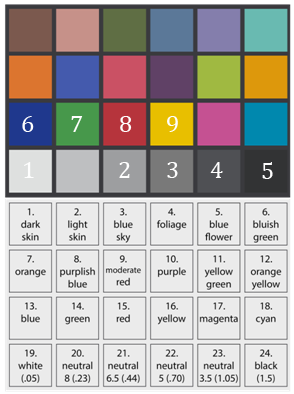

# IDL RCIPP Widget

A Radiometric and Colourimetric Image Processing Pipeline (RCIPP) widget for changing an image taken by the Martian rovers, Spirit and Opportunity, to what it would look like under Earth's lighting conditions. This also works for Aberystwyth University PanCam Emulator (AUPE) images. It can also create a graph for hyperspectral Regions Of Interest (ROI).

**This program requires the [IDL environment](http://www.harrisgeospatial.com/IntelliEarthSolutions/GeospatialProducts/IDL.aspx) to run.**

Further Information:

[https://www.aber.ac.uk/en/research/excellence/impact/mars/](https://www.aber.ac.uk/en/research/excellence/impact/mars/)

## INSTRUCTIONS

### For raw AUPE data (test AUPE images provided in bin/Test_AUPE_Images)
1. Navigate to the bin folder
2. Start RCIPP.sav file 
3. For AUPE data: make sure that all data is labelled in the same manner the same (e.g.  they should all follow: f01.png, f02.png etc.. or they should follow: f1.png, f2.png etc) 
4. For AUPE data: Make sure all data that will be used is in folders labelled either: ‘LWAC’ or ‘RWAC’
5. Start at ‘Generate RGB image’ (you can start earlier but those buttons only bring up information boxes saying that they do not work yet)
6. Navigate your way to the AUPE data
7. Select 1 file for a black and white image or three files for a colour image (typically you would choose f3, f2, f1 as they are the broadband R, G, B filters, respectively.)
8. Press ‘Radiance Scaling Factor and Offset’
9. A new window will open up
10. Press ‘select ROI’ (this can be skipped if the ROI have already been selected and saved previously. If that’s the case then move on to ‘restore ROI’. I will include a ROI .sav file for the LWAC Iceland images, so if you’re using the example data, you can use that and therefore skip this step)
11. Using the XROI window that pops up and the tool provided, select the following ROIs in the order shown:

12. Save the ROIs with a suitable name (it needs to be a .sav file)
13. Close the XROI window
14. Press the ‘restore ROI’ button
15. Select the ROI .sav file you have created
16. Close the window that opens up displaying the ROIs
17. Press ‘Calculate Statistics
18. Select ‘f4.png’ to ‘f9.png’ (no lab data is available for the other filters and so the radiance scaling factor and offset cannot be created for those)
19. Close each XROI window as it opens up
20. Press ‘Create Histogram’
21. At the bottom of the histogram widget, un-tick any colours that you do not wish to use (e.g. White due to it being overexposed)
22. Close the histogram widget
23. Press ‘Calculate radiance per sec’
24. Select either RWAC or LWAC depending on where the images are from
25. Press ‘Radiance Scaling Factor and Offset’ (The Radiance Scaling Factor and Offset will be placed into a file in the directory. Graphs of the line of best fit will open up )

### For processed AUPE or PDS data
1. Press either ‘Load AUPE data’ or ‘Load PDS data’
2. Select one or three files to get a black and white or colour image respectively (please note that R* cannot currently be created for RWAC, so it is advisable to use LWAC data if pressing the ‘Load AUPE data’ button)
3. Press ‘generate R*’ 
4. If the user is processing AUPE data then a new widget will open up. This has the possibility of having the following buttons: “get exposure values”, “radiance scaling factor values”, “generate R* for LWAC” and “generate R* for RWAC”. 
If the “get exposure values” button appears, then press it and the program will retrieve the exposure values. The user does not need to do anything aside from pressing the button
If the “Radiance Scaling factor values” button appears, then the user should press it and navigate to a directory which has radiance scaling factor values that can be used for this image (this is usually used when the image does not have a calibration target). The files will have a name such as the following: ‘radiometric_scaling_factor_wavelength_740.dat’. Once all the files are selected, press enter, and the program will automatically copy them in the correct directory
If the “generate R* for LWAC” and “generate R* for RWAC” buttons appear, then select the button for which the R* data should calculated for (or select both, one at a time). Select the files (this can only be done for the 6 files that were selected during the ‘Calculate Statistics’ button, namely, ‘f4.png’ to ‘f9.png’) and press enter
5. ‘Create ROI graph’ is not needed for colour correction, please see information below regarding this button
6. Press ‘Generate CIE data’
7. A new widget will open
8. Either press ‘calculate N’ (if there is no n.dat in your directory)
9. Or press ‘Restore N’ (if there is a n.dat in your directory)
10. Press ‘Save x,y,Y’ if you want to save the arrays (recommended)
11. Close the small widget
12. Press ‘CIE to sRGB’
13. A new widget will open up
14. Press ‘restore x,y,Y’ if you have previously saved them
15. Press ‘CIE to sRGB’

### For ‘Create ROI graph’
#### AUPE data:

1.  Once the button has been pressed a new widget will open up
2. Select if you want to create a graph for LWAC data, RWAC data or both
3. If you only want to create a graph for one side, then follow the buttons under the LWAC or RWAC signs depending on which you want to create the graph for. If you want to create a graph for both combined, then the buttons on both sides. This can be done in any order providing that select ROI comes before Restore ROI and that comes before Choose R*
4. Press the ‘Select ROI’ 
5. Using the XROI window that appears, select one ROI and save it in a sensible directory
6. Close XROI
7. Press ‘Restore ROI’
8. Find the ROI .sav that was created
9. Close the XROI window that appears
10. Choose the R* files that you created and that you want to use in the graph 
11. Close the black XROI windows that open up (this has to be done otherwise the program cannot continue)
12. Press ‘Create Graph’
13. A graph should open up

#### For PDS Data:
14. Once the button has been pressed a new widget will open up
15. Press the ‘Select ROI’
16. Using the XROI window that appears, select one ROI and save it in a sensible directory
17. Close XROI
18. Press ‘Restore ROI’
19. Find the ROI .sav that was created
20. Close the XROI window that appears
21. Press ‘Create Graph’
22. Select the R* files for which the graph should be drawn (for PDS data, please select these from largest wavelength to smallest)
23. Close the black XROI windows that open up (this has to be done otherwise the program cannot continue)
24. A graph should open up

### Please note:
The ROI graph can currently only be created for LWAC AUPE and PDS data. That means that for AUPE data, the graph will only be drawn over the wavelengths: ~400 to ~700
The smaller widgets that open up when pressing the buttons ‘radiance scaling factor and offset’, ‘create ROI graph’ and ‘generate CIE data’, can only be opened ONCE. This means that if they need to be pressed again, the program needs to be closed and opened up again
The normalisation that occurs during the ‘Create CIE XYZ’ is currently set to 10. If the sRGB image comes out white, then this needs to be increased. If it comes out black then this needs to be decreased. This has to be done in the source code.
